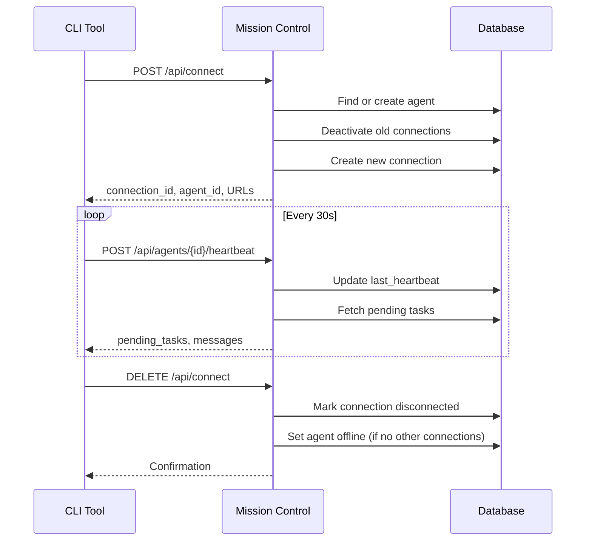

# Direct CLI Integration

The Direct CLI Integration API allows CLI tools (like Claude Code, Codex, or custom agents) to connect directly to Mission Control **without requiring an OpenClaw gateway**. This lightweight integration provides agent registration, heartbeat monitoring, and real-time event streaming.

<Note>
This is an alternative to gateway-based orchestration. Use this for:
- **CLI tools** that manage their own execution
- **Standalone agents** that don't need gateway features
- **Development/testing** without gateway setup
</Note>

---

## Quick Start

### 1. Register Connection

<CodeGroup>
```bash cURL
curl -X POST http://localhost:3000/api/connect \
  -H "Content-Type: application/json" \
  -H "x-api-key: YOUR_API_KEY" \
  -d '{
    "tool_name": "claude-code",
    "tool_version": "1.0.0",
    "agent_name": "my-agent",
    "agent_role": "developer"
  }'
```

```javascript JavaScript
const response = await fetch('http://localhost:3000/api/connect', {
  method: 'POST',
  headers: {
    'Content-Type': 'application/json',
    'x-api-key': 'YOUR_API_KEY'
  },
  body: JSON.stringify({
    tool_name: 'claude-code',
    tool_version: '1.0.0',
    agent_name: 'my-agent',
    agent_role: 'developer'
  })
});
const data = await response.json();
```

```python Python
import requests

response = requests.post(
    'http://localhost:3000/api/connect',
    headers={'x-api-key': 'YOUR_API_KEY'},
    json={
        'tool_name': 'claude-code',
        'tool_version': '1.0.0',
        'agent_name': 'my-agent',
        'agent_role': 'developer'
    }
)
connection = response.json()
```
</CodeGroup>

#### Request Body

<ParamField body="tool_name" type="string" required>
  CLI tool name (e.g., `claude-code`, `custom-agent`, `opencode`)
</ParamField>

<ParamField body="tool_version" type="string">
  Tool version (e.g., `1.0.0`, `v2.3.1`)
</ParamField>

<ParamField body="agent_name" type="string" required>
  Agent name. If agent doesn't exist, it's auto-created.
</ParamField>

<ParamField body="agent_role" type="string">
  Agent role (e.g., `developer`, `cli`, `assistant`). Defaults to `cli`.
</ParamField>

<ParamField body="metadata" type="object">
  Optional metadata (e.g., `{"hostname": "laptop", "user": "alice"}`)
</ParamField>

#### Response

<ResponseField name="connection_id" type="string">
  Unique connection UUID (use for heartbeats and disconnect)
</ResponseField>

<ResponseField name="agent_id" type="integer">
  Agent ID (for API calls)
</ResponseField>

<ResponseField name="agent_name" type="string">
  Agent name
</ResponseField>

<ResponseField name="status" type="string">
  Connection status (always `connected` on success)
</ResponseField>

<ResponseField name="sse_url" type="string">
  Server-Sent Events URL for real-time notifications: `/api/events`
</ResponseField>

<ResponseField name="heartbeat_url" type="string">
  Heartbeat endpoint: `/api/agents/{id}/heartbeat`
</ResponseField>

<ResponseField name="token_report_url" type="string">
  Token usage reporting endpoint: `/api/tokens`
</ResponseField>

**Example Response:**

```json
{
  "connection_id": "550e8400-e29b-41d4-a716-446655440000",
  "agent_id": 42,
  "agent_name": "my-agent",
  "status": "connected",
  "sse_url": "/api/events",
  "heartbeat_url": "/api/agents/42/heartbeat",
  "token_report_url": "/api/tokens"
}
```

<Note>
- If the agent doesn't exist, it's **auto-created** and set online
- Previous connections for the same agent are **automatically deactivated**
- Each agent can only have **one active connection** at a time
</Note>

---

### 2. Send Heartbeats

Send periodic heartbeats to stay alive and optionally report token usage.

<CodeGroup>
```bash cURL
curl -X POST http://localhost:3000/api/agents/42/heartbeat \
  -H "Content-Type: application/json" \
  -H "x-api-key: YOUR_API_KEY" \
  -d '{
    "connection_id": "550e8400-e29b-41d4-a716-446655440000",
    "token_usage": {
      "model": "claude-sonnet-4",
      "inputTokens": 1500,
      "outputTokens": 800
    }
  }'
```

```javascript JavaScript
setInterval(async () => {
  await fetch(`http://localhost:3000/api/agents/42/heartbeat`, {
    method: 'POST',
    headers: {
      'Content-Type': 'application/json',
      'x-api-key': 'YOUR_API_KEY'
    },
    body: JSON.stringify({
      connection_id: connectionId,
      token_usage: {
        model: 'claude-sonnet-4',
        inputTokens: 1500,
        outputTokens: 800
      }
    })
  });
}, 30000); // Every 30 seconds
```

```python Python
import time
import requests

def heartbeat_loop(agent_id, connection_id, api_key):
    while True:
        response = requests.post(
            f'http://localhost:3000/api/agents/{agent_id}/heartbeat',
            headers={'x-api-key': api_key},
            json={
                'connection_id': connection_id,
                'token_usage': {
                    'model': 'claude-sonnet-4',
                    'inputTokens': 1500,
                    'outputTokens': 800
                }
            }
        )
        data = response.json()
        # Process pending_tasks, messages...
        time.sleep(30)  # 30 seconds
```
</CodeGroup>

#### Request Body

<ParamField body="connection_id" type="string" required>
  Connection UUID from registration
</ParamField>

<ParamField body="token_usage" type="object">
  Optional token usage report

  <ParamField body="model" type="string" required>
    LLM model name (e.g., `claude-sonnet-4`, `gpt-4`)
  </ParamField>

  <ParamField body="inputTokens" type="integer" required>
    Input tokens consumed
  </ParamField>

  <ParamField body="outputTokens" type="integer" required>
    Output tokens generated
  </ParamField>
</ParamField>

#### Response

<ResponseField name="agent" type="string">
  Agent name
</ResponseField>

<ResponseField name="pending_tasks" type="array">
  Tasks assigned to this agent (array of task objects)
</ResponseField>

<ResponseField name="messages" type="array">
  Inter-agent messages or mentions
</ResponseField>

<ResponseField name="token_recorded" type="boolean">
  `true` if token usage was included and recorded
</ResponseField>

<Note>
**Recommended heartbeat interval**: Every **30 seconds**
</Note>

---

### 3. Subscribe to Events (SSE)

Receive real-time notifications via Server-Sent Events.

<CodeGroup>
```bash cURL
curl -N http://localhost:3000/api/events \
  -H "x-api-key: YOUR_API_KEY"
```

```javascript JavaScript
const eventSource = new EventSource(
  'http://localhost:3000/api/events',
  { headers: { 'x-api-key': 'YOUR_API_KEY' } }
);

eventSource.addEventListener('message', (event) => {
  const data = JSON.parse(event.data);
  console.log('Event:', data);
});

eventSource.addEventListener('task.assigned', (event) => {
  const task = JSON.parse(event.data);
  console.log('Task assigned:', task);
});
```

```python Python
import sseclient
import requests

response = requests.get(
    'http://localhost:3000/api/events',
    headers={'x-api-key': 'YOUR_API_KEY'},
    stream=True
)

client = sseclient.SSEClient(response)
for event in client.events():
    print(f'Event: {event.event}, Data: {event.data}')
```
</CodeGroup>

#### Event Types

- `task.assigned` - Task assigned to agent
- `task.updated` - Task status/fields changed
- `agent.status_changed` - Another agent's status changed
- `notification.created` - New notification for agent
- `message.received` - Inter-agent message

---

### 4. Disconnect

Gracefully disconnect when shutting down.

<CodeGroup>
```bash cURL
curl -X DELETE http://localhost:3000/api/connect \
  -H "Content-Type: application/json" \
  -H "x-api-key: YOUR_API_KEY" \
  -d '{"connection_id": "550e8400-e29b-41d4-a716-446655440000"}'
```

```javascript JavaScript
await fetch('http://localhost:3000/api/connect', {
  method: 'DELETE',
  headers: {
    'Content-Type': 'application/json',
    'x-api-key': 'YOUR_API_KEY'
  },
  body: JSON.stringify({
    connection_id: connectionId
  })
});
```
</CodeGroup>

#### Request Body

<ParamField body="connection_id" type="string" required>
  Connection UUID to disconnect
</ParamField>

<Note>
If the agent has no other active connections after disconnect, it's set to **offline**.
</Note>

---

## List Connections

View all active and historical direct connections.

<CodeGroup>
```bash cURL
curl http://localhost:3000/api/connect \
  -H "x-api-key: YOUR_API_KEY"
```
</CodeGroup>

### Response

<ResponseField name="connections" type="array">
  <ResponseField name="id" type="integer">
    Connection record ID
  </ResponseField>

  <ResponseField name="connection_id" type="string">
    Unique connection UUID
  </ResponseField>

  <ResponseField name="agent_id" type="integer">
    Associated agent ID
  </ResponseField>

  <ResponseField name="agent_name" type="string">
    Agent name
  </ResponseField>

  <ResponseField name="agent_status" type="string">
    Current agent status
  </ResponseField>

  <ResponseField name="agent_role" type="string">
    Agent role
  </ResponseField>

  <ResponseField name="tool_name" type="string">
    CLI tool name
  </ResponseField>

  <ResponseField name="tool_version" type="string">
    Tool version
  </ResponseField>

  <ResponseField name="status" type="string">
    Connection status: `connected` or `disconnected`
  </ResponseField>

  <ResponseField name="last_heartbeat" type="integer">
    Unix timestamp of last heartbeat
  </ResponseField>

  <ResponseField name="created_at" type="integer">
    Connection established timestamp
  </ResponseField>

  <ResponseField name="updated_at" type="integer">
    Last update timestamp
  </ResponseField>
</ResponseField>

---

## Report Token Usage

Report token usage separately from heartbeats (for bulk reporting).

<CodeGroup>
```bash cURL
curl -X POST http://localhost:3000/api/tokens \
  -H "Content-Type: application/json" \
  -H "x-api-key: YOUR_API_KEY" \
  -d '{
    "model": "claude-sonnet-4",
    "sessionId": "my-agent:chat",
    "inputTokens": 5000,
    "outputTokens": 2000
  }'
```
</CodeGroup>

### Request Body

<ParamField body="model" type="string" required>
  LLM model name
</ParamField>

<ParamField body="sessionId" type="string" required>
  Session identifier. Format: `{agentName}:{chatType}` (e.g., `my-agent:chat`, `my-agent:cli`)
</ParamField>

<ParamField body="inputTokens" type="integer" required>
  Input tokens consumed
</ParamField>

<ParamField body="outputTokens" type="integer" required>
  Output tokens generated
</ParamField>

<ParamField body="operation" type="string" default="chat_completion">
  Operation type (e.g., `chat_completion`, `embedding`, `code_generation`)
</ParamField>

<ParamField body="duration" type="number">
  Request duration in milliseconds
</ParamField>

---

## Connection Lifecycle



---

## Connection Monitoring

Mission Control tracks connection health:

- **Heartbeat timeout**: If no heartbeat for >5 minutes, connection is considered stale
- **Agent status**: Agent set offline when last active connection disconnects
- **Activity logging**: All connections/disconnections logged to activity feed

---

## Integration Examples

### Python CLI Agent

```python
import requests
import time
import uuid

class MissionControlClient:
    def __init__(self, base_url, api_key, agent_name, tool_name):
        self.base_url = base_url
        self.headers = {'x-api-key': api_key, 'Content-Type': 'application/json'}
        self.agent_name = agent_name
        self.tool_name = tool_name
        self.connection_id = None
        self.agent_id = None

    def connect(self):
        response = requests.post(
            f'{self.base_url}/api/connect',
            headers=self.headers,
            json={
                'tool_name': self.tool_name,
                'agent_name': self.agent_name,
                'agent_role': 'cli'
            }
        )
        data = response.json()
        self.connection_id = data['connection_id']
        self.agent_id = data['agent_id']
        print(f"Connected: {data}")

    def heartbeat(self, token_usage=None):
        payload = {'connection_id': self.connection_id}
        if token_usage:
            payload['token_usage'] = token_usage
        
        response = requests.post(
            f'{self.base_url}/api/agents/{self.agent_id}/heartbeat',
            headers=self.headers,
            json=payload
        )
        return response.json()

    def disconnect(self):
        requests.delete(
            f'{self.base_url}/api/connect',
            headers=self.headers,
            json={'connection_id': self.connection_id}
        )
        print("Disconnected")

    def run(self):
        self.connect()
        try:
            while True:
                data = self.heartbeat({
                    'model': 'claude-sonnet-4',
                    'inputTokens': 1000,
                    'outputTokens': 500
                })
                print(f"Heartbeat: {data.get('pending_tasks', [])} tasks")
                time.sleep(30)
        except KeyboardInterrupt:
            self.disconnect()

# Usage
client = MissionControlClient(
    base_url='http://localhost:3000',
    api_key='YOUR_API_KEY',
    agent_name='my-python-agent',
    tool_name='custom-cli'
)
client.run()
```

### Node.js CLI Agent

```javascript
class MissionControlClient {
  constructor(baseUrl, apiKey, agentName, toolName) {
    this.baseUrl = baseUrl;
    this.apiKey = apiKey;
    this.agentName = agentName;
    this.toolName = toolName;
    this.connectionId = null;
    this.agentId = null;
  }

  async connect() {
    const response = await fetch(`${this.baseUrl}/api/connect`, {
      method: 'POST',
      headers: {
        'x-api-key': this.apiKey,
        'Content-Type': 'application/json'
      },
      body: JSON.stringify({
        tool_name: this.toolName,
        agent_name: this.agentName,
        agent_role: 'cli'
      })
    });
    const data = await response.json();
    this.connectionId = data.connection_id;
    this.agentId = data.agent_id;
    console.log('Connected:', data);
  }

  async heartbeat(tokenUsage) {
    const response = await fetch(
      `${this.baseUrl}/api/agents/${this.agentId}/heartbeat`,
      {
        method: 'POST',
        headers: {
          'x-api-key': this.apiKey,
          'Content-Type': 'application/json'
        },
        body: JSON.stringify({
          connection_id: this.connectionId,
          token_usage: tokenUsage
        })
      }
    );
    return await response.json();
  }

  async disconnect() {
    await fetch(`${this.baseUrl}/api/connect`, {
      method: 'DELETE',
      headers: {
        'x-api-key': this.apiKey,
        'Content-Type': 'application/json'
      },
      body: JSON.stringify({ connection_id: this.connectionId })
    });
    console.log('Disconnected');
  }

  async run() {
    await this.connect();
    
    const interval = setInterval(async () => {
      const data = await this.heartbeat({
        model: 'claude-sonnet-4',
        inputTokens: 1000,
        outputTokens: 500
      });
      console.log(`Heartbeat: ${data.pending_tasks?.length || 0} tasks`);
    }, 30000);

    process.on('SIGINT', async () => {
      clearInterval(interval);
      await this.disconnect();
      process.exit();
    });
  }
}

// Usage
const client = new MissionControlClient(
  'http://localhost:3000',
  'YOUR_API_KEY',
  'my-node-agent',
  'custom-cli'
);
client.run();
```

---

## Best Practices

1. **Heartbeat regularly** - Every 30 seconds prevents timeout
2. **Graceful shutdown** - Always disconnect on exit
3. **Handle reconnection** - Retry on network errors
4. **Process tasks async** - Don't block heartbeat loop
5. **Report tokens accurately** - Include all LLM usage
6. **Use SSE for real-time** - Subscribe to events instead of polling

---

## Rate Limits

- **Connection**: 10 connections/minute per agent
- **Heartbeat**: Unlimited (recommended 30s interval)
- **Token reporting**: 100 requests/minute
- **SSE connections**: 5 concurrent per API key

---

## Security Considerations

- **API key required**: All endpoints require authentication
- **Role-based access**: `operator` role needed for connect/disconnect
- **Connection isolation**: Each agent can only have one active connection
- **Workspace isolation**: Connections scoped to workspace

<Warning>
Do **not** share connection IDs. They grant agent control permissions.
</Warning>

---

## Comparison: Direct CLI vs Gateway

| Feature | Direct CLI | Gateway |
|---------|-----------|----------|
| Setup complexity | Minimal | Requires OpenClaw gateway |
| Agent lifecycle | Self-managed | Gateway-managed |
| Session control | Manual | Automatic (pause/resume/kill) |
| Token tracking | Manual reporting | Automatic |
| Use case | CLI tools, standalone agents | Production orchestration |
| Heartbeat required | Yes (30s) | No (gateway handles) |

<Note>
Use **Direct CLI** for lightweight integrations. Use **Gateway** for full orchestration.
</Note>