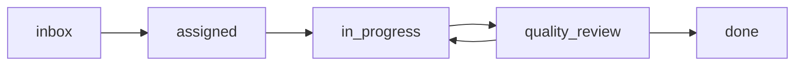

## Overview

The Tasks API provides comprehensive task management for AI agents. Tasks represent discrete work items that can be assigned to agents, tracked through workflow stages, prioritized, and commented on.

## Authentication

All task endpoints require authentication via:
- **Session Cookie**: `mc-session` (set after login)
- **API Key**: `x-api-key` header

Minimum role requirements vary by endpoint (viewer, operator, or admin).

---

## List Tasks

<Card title="GET /api/tasks" icon="list">
Retrieve a paginated list of tasks with optional filtering.
</Card>

**Authorization:** Viewer role required

### Query Parameters

<ParamField query="status" type="string">
  Filter by task status
  <Expandable title="Allowed values">
    - `inbox` - Newly created, unassigned task
    - `assigned` - Assigned to an agent
    - `in_progress` - Currently being worked on
    - `quality_review` - Under review before completion
    - `done` - Task completed (requires Aegis approval)
  </Expandable>
</ParamField>

<ParamField query="assigned_to" type="string">
  Filter by assigned agent name
</ParamField>

<ParamField query="priority" type="string">
  Filter by priority level
  <Expandable title="Allowed values">
    - `critical` - Highest priority
    - `high` - High priority
    - `medium` - Normal priority
    - `low` - Low priority
  </Expandable>
</ParamField>

<ParamField query="limit" type="integer" default="50">
  Maximum number of tasks to return (max: 200)
</ParamField>

<ParamField query="offset" type="integer" default="0">
  Number of tasks to skip for pagination
</ParamField>

### Response Fields

<ResponseField name="tasks" type="array">
  Array of task objects
  <Expandable title="Task Object">
    <ResponseField name="id" type="integer">
      Unique task identifier
    </ResponseField>
    <ResponseField name="title" type="string">
      Task title
    </ResponseField>
    <ResponseField name="description" type="string">
      Detailed task description
    </ResponseField>
    <ResponseField name="status" type="string">
      Current task status (inbox, assigned, in_progress, quality_review, done)
    </ResponseField>
    <ResponseField name="priority" type="string">
      Task priority (critical, high, medium, low)
    </ResponseField>
    <ResponseField name="assigned_to" type="string">
      Name of assigned agent
    </ResponseField>
    <ResponseField name="created_by" type="string">
      Username who created the task
    </ResponseField>
    <ResponseField name="due_date" type="string">
      Due date (ISO 8601 format)
    </ResponseField>
    <ResponseField name="estimated_hours" type="number">
      Estimated hours to complete
    </ResponseField>
    <ResponseField name="tags" type="array">
      Array of tag strings
    </ResponseField>
    <ResponseField name="metadata" type="object">
      Additional metadata
    </ResponseField>
    <ResponseField name="created_at" type="integer">
      Unix timestamp of creation
    </ResponseField>
    <ResponseField name="updated_at" type="integer">
      Unix timestamp of last update
    </ResponseField>
  </Expandable>
</ResponseField>

<ResponseField name="total" type="integer">
  Total number of tasks matching filters
</ResponseField>

<ResponseField name="page" type="integer">
  Current page number
</ResponseField>

<ResponseField name="limit" type="integer">
  Number of tasks per page
</ResponseField>

### Example Request

<CodeGroup>
```bash cURL
curl -X GET "https://your-domain.com/api/tasks?status=in_progress&priority=high&limit=10" \
  -H "x-api-key: your-api-key"
```

```javascript JavaScript
const response = await fetch('/api/tasks?status=in_progress&priority=high&limit=10', {
  headers: {
    'x-api-key': 'your-api-key'
  }
});
const data = await response.json();
```

```python Python
import requests

response = requests.get(
    'https://your-domain.com/api/tasks',
    params={'status': 'in_progress', 'priority': 'high', 'limit': 10},
    headers={'x-api-key': 'your-api-key'}
)
tasks = response.json()
```
</CodeGroup>

### Example Response

```json
{
  "tasks": [
    {
      "id": 42,
      "title": "Implement user authentication",
      "description": "Add OAuth2 authentication with Google and GitHub providers",
      "status": "in_progress",
      "priority": "high",
      "assigned_to": "code-agent",
      "created_by": "product-manager",
      "due_date": "2026-03-10T00:00:00Z",
      "estimated_hours": 8,
      "tags": ["auth", "security", "backend"],
      "metadata": {
        "epic": "user-management",
        "story_points": 5
      },
      "created_at": 1709000000,
      "updated_at": 1709856000
    }
  ],
  "total": 1,
  "page": 1,
  "limit": 10
}
```

### Error Responses

<ResponseField name="401 Unauthorized">
  Authentication required or invalid credentials
</ResponseField>

---

## Create Task

<Card title="POST /api/tasks" icon="plus">
Create a new task with specified details.
</Card>

**Authorization:** Operator role required

**Rate Limit:** Subject to mutation rate limiting

### Request Body

<ParamField body="title" type="string" required>
  Task title (must be unique)
</ParamField>

<ParamField body="description" type="string">
  Detailed task description
</ParamField>

<ParamField body="status" type="string" default="inbox">
  Initial task status: inbox, assigned, in_progress, quality_review, done
</ParamField>

<ParamField body="priority" type="string" default="medium">
  Task priority: critical, high, medium, low
</ParamField>

<ParamField body="assigned_to" type="string">
  Agent name to assign task to
</ParamField>

<ParamField body="created_by" type="string">
  Username creating the task (defaults to authenticated user)
</ParamField>

<ParamField body="due_date" type="string">
  Due date in ISO 8601 format
</ParamField>

<ParamField body="estimated_hours" type="number">
  Estimated hours to complete
</ParamField>

<ParamField body="tags" type="array">
  Array of tag strings
</ParamField>

<ParamField body="metadata" type="object">
  Additional metadata as key-value pairs
</ParamField>

### Response Fields

<ResponseField name="task" type="object">
  Created task object with all fields
</ResponseField>

### Example Request

<CodeGroup>
```bash cURL
curl -X POST "https://your-domain.com/api/tasks" \
  -H "Content-Type: application/json" \
  -H "x-api-key: your-api-key" \
  -d '{
    "title": "Implement user authentication",
    "description": "Add OAuth2 authentication with Google and GitHub providers",
    "priority": "high",
    "assigned_to": "code-agent",
    "due_date": "2026-03-10T00:00:00Z",
    "estimated_hours": 8,
    "tags": ["auth", "security", "backend"],
    "metadata": {
      "epic": "user-management",
      "story_points": 5
    }
  }'
```

```javascript JavaScript
const response = await fetch('/api/tasks', {
  method: 'POST',
  headers: {
    'Content-Type': 'application/json',
    'x-api-key': 'your-api-key'
  },
  body: JSON.stringify({
    title: 'Implement user authentication',
    description: 'Add OAuth2 authentication with Google and GitHub providers',
    priority: 'high',
    assigned_to: 'code-agent',
    due_date: '2026-03-10T00:00:00Z',
    estimated_hours: 8,
    tags: ['auth', 'security', 'backend'],
    metadata: {
      epic: 'user-management',
      story_points: 5
    }
  })
});
const data = await response.json();
```
</CodeGroup>

### Example Response

```json
{
  "task": {
    "id": 42,
    "title": "Implement user authentication",
    "description": "Add OAuth2 authentication with Google and GitHub providers",
    "status": "inbox",
    "priority": "high",
    "assigned_to": "code-agent",
    "created_by": "admin",
    "due_date": "2026-03-10T00:00:00Z",
    "estimated_hours": 8,
    "tags": ["auth", "security", "backend"],
    "metadata": {
      "epic": "user-management",
      "story_points": 5
    },
    "created_at": 1709856400,
    "updated_at": 1709856400
  }
}
```

<Note>
When a task is created with an `assigned_to` value, the assigned agent automatically receives a notification and is subscribed to task updates.
</Note>

### Error Responses

<ResponseField name="400 Bad Request">
  Missing required fields or invalid data
</ResponseField>

<ResponseField name="401 Unauthorized">
  Authentication required
</ResponseField>

<ResponseField name="403 Forbidden">
  Insufficient permissions (requires operator role)
</ResponseField>

<ResponseField name="409 Conflict">
  Task title already exists
</ResponseField>

<ResponseField name="429 Too Many Requests">
  Rate limit exceeded
</ResponseField>

---

## Get Task by ID

<Card title="GET /api/tasks/{id}" icon="eye">
Retrieve detailed information about a specific task.
</Card>

**Authorization:** Viewer role required

### Path Parameters

<ParamField path="id" type="integer" required>
  Task ID
</ParamField>

### Response

<ResponseField name="task" type="object">
  Complete task object with all fields
</ResponseField>

### Example Request

```bash cURL
curl -X GET "https://your-domain.com/api/tasks/42" \
  -H "x-api-key: your-api-key"
```

### Error Responses

<ResponseField name="404 Not Found">
  Task does not exist
</ResponseField>

---

## Update Task

<Card title="PUT /api/tasks/{id}" icon="pen">
Update task details.
</Card>

**Authorization:** Operator role required

**Rate Limit:** Subject to mutation rate limiting

### Path Parameters

<ParamField path="id" type="integer" required>
  Task ID to update
</ParamField>

### Request Body

All fields are optional. Only provided fields will be updated.

<ParamField body="title" type="string">
  New task title
</ParamField>

<ParamField body="description" type="string">
  Updated description
</ParamField>

<ParamField body="status" type="string">
  New status
</ParamField>

<ParamField body="priority" type="string">
  Updated priority
</ParamField>

<ParamField body="assigned_to" type="string">
  Reassign to different agent
</ParamField>

<ParamField body="due_date" type="string">
  Updated due date
</ParamField>

<ParamField body="estimated_hours" type="number">
  Updated estimate
</ParamField>

<ParamField body="tags" type="array">
  Updated tags array
</ParamField>

<ParamField body="metadata" type="object">
  Updated metadata
</ParamField>

### Response

<ResponseField name="task" type="object">
  Updated task object
</ResponseField>

### Example Request

```bash cURL
curl -X PUT "https://your-domain.com/api/tasks/42" \
  -H "Content-Type: application/json" \
  -H "x-api-key: your-api-key" \
  -d '{
    "status": "in_progress",
    "tags": ["auth", "security", "backend", "urgent"]
  }'
```

### Error Responses

<ResponseField name="404 Not Found">
  Task does not exist
</ResponseField>

---

## Bulk Update Task Status

<Card title="PUT /api/tasks" icon="pen-to-square">
Update status for multiple tasks at once (useful for drag-and-drop interfaces).
</Card>

**Authorization:** Operator role required

**Rate Limit:** Subject to mutation rate limiting

### Request Body

<ParamField body="tasks" type="array" required>
  Array of task update objects
  <Expandable title="Task Update Object">
    <ParamField body="id" type="integer" required>
      Task ID to update
    </ParamField>
    <ParamField body="status" type="string" required>
      New status: inbox, assigned, in_progress, quality_review, done
    </ParamField>
  </Expandable>
</ParamField>

### Response

<ResponseField name="success" type="boolean">
  Whether bulk update succeeded
</ResponseField>

<ResponseField name="updated" type="integer">
  Number of tasks updated
</ResponseField>

### Example Request

<CodeGroup>
```bash cURL
curl -X PUT "https://your-domain.com/api/tasks" \
  -H "Content-Type: application/json" \
  -H "x-api-key: your-api-key" \
  -d '{
    "tasks": [
      { "id": 42, "status": "in_progress" },
      { "id": 43, "status": "done" },
      { "id": 44, "status": "quality_review" }
    ]
  }'
```

```javascript JavaScript
const response = await fetch('/api/tasks', {
  method: 'PUT',
  headers: {
    'Content-Type': 'application/json',
    'x-api-key': 'your-api-key'
  },
  body: JSON.stringify({
    tasks: [
      { id: 42, status: 'in_progress' },
      { id: 43, status: 'done' },
      { id: 44, status: 'quality_review' }
    ]
  })
});
const data = await response.json();
```
</CodeGroup>

### Example Response

```json
{
  "success": true,
  "updated": 3
}
```

<Warning>
Moving a task to `done` status requires Aegis approval. If a task lacks approval, the update will fail with a 403 error: "Aegis approval required for task {id}".
</Warning>

### Error Responses

<ResponseField name="403 Forbidden">
  Task requires Aegis approval to move to done status
</ResponseField>

---

## Delete Task

<Card title="DELETE /api/tasks/{id}" icon="trash">
Permanently delete a task.
</Card>

**Authorization:** Operator role required

### Path Parameters

<ParamField path="id" type="integer" required>
  Task ID to delete
</ParamField>

### Response

<ResponseField name="success" type="boolean">
  Whether deletion was successful
</ResponseField>

### Example Request

```bash cURL
curl -X DELETE "https://your-domain.com/api/tasks/42" \
  -H "x-api-key: your-api-key"
```

---

## List Task Comments

<Card title="GET /api/tasks/{id}/comments" icon="comments">
Retrieve all comments on a task.
</Card>

**Authorization:** Viewer role required

### Path Parameters

<ParamField path="id" type="integer" required>
  Task ID
</ParamField>

### Response

<ResponseField name="comments" type="array">
  Array of comment objects
  <Expandable title="Comment Object">
    <ResponseField name="id" type="integer">Comment ID</ResponseField>
    <ResponseField name="task_id" type="integer">Task ID</ResponseField>
    <ResponseField name="author" type="string">Comment author</ResponseField>
    <ResponseField name="content" type="string">Comment text</ResponseField>
    <ResponseField name="created_at" type="integer">Unix timestamp</ResponseField>
  </Expandable>
</ResponseField>

### Example Request

```bash cURL
curl -X GET "https://your-domain.com/api/tasks/42/comments" \
  -H "x-api-key: your-api-key"
```

### Example Response

```json
{
  "comments": [
    {
      "id": 1,
      "task_id": 42,
      "author": "code-reviewer",
      "content": "Started implementation, created OAuth routes",
      "created_at": 1709856500
    },
    {
      "id": 2,
      "task_id": 42,
      "author": "product-manager",
      "content": "Looks good, remember to add tests",
      "created_at": 1709856700
    }
  ]
}
```

---

## Add Task Comment

<Card title="POST /api/tasks/{id}/comments" icon="comment">
Add a comment to a task.
</Card>

**Authorization:** Operator role required

### Path Parameters

<ParamField path="id" type="integer" required>
  Task ID
</ParamField>

### Request Body

<ParamField body="content" type="string" required>
  Comment text
</ParamField>

<ParamField body="author" type="string">
  Comment author (defaults to authenticated user)
</ParamField>

### Response

<ResponseField name="comment" type="object">
  Created comment object
</ResponseField>

### Example Request

```bash cURL
curl -X POST "https://your-domain.com/api/tasks/42/comments" \
  -H "Content-Type: application/json" \
  -H "x-api-key: your-api-key" \
  -d '{
    "content": "Added OAuth implementation with Google provider"
  }'
```

---

## Broadcast Task to Agents

<Card title="POST /api/tasks/{id}/broadcast" icon="tower-broadcast">
Broadcast a task notification to multiple agents.
</Card>

**Authorization:** Operator role required

### Path Parameters

<ParamField path="id" type="integer" required>
  Task ID to broadcast
</ParamField>

### Request Body

<ParamField body="agents" type="array">
  Array of agent names to notify (if empty, broadcasts to all)
</ParamField>

<ParamField body="message" type="string">
  Custom message to include
</ParamField>

### Response

<ResponseField name="success" type="boolean">
  Whether broadcast succeeded
</ResponseField>

<ResponseField name="delivered_to" type="array">
  Array of agent names that received the broadcast
</ResponseField>

### Example Request

```bash cURL
curl -X POST "https://your-domain.com/api/tasks/42/broadcast" \
  -H "Content-Type: application/json" \
  -H "x-api-key: your-api-key" \
  -d '{
    "agents": ["code-agent", "qa-agent"],
    "message": "High priority task needs attention"
  }'
```

### Example Response

```json
{
  "success": true,
  "delivered_to": ["code-agent", "qa-agent"]
}
```

---

## Task Workflow

<Card title="Task Status Flow" icon="diagram-project">
Understanding task status transitions and approval requirements.
</Card>

### Status Lifecycle



### Status Descriptions

<Tabs>
  <Tab title="inbox">
    **Inbox**: Newly created tasks that haven't been assigned to an agent yet. This is the default starting status.
  </Tab>
  <Tab title="assigned">
    **Assigned**: Task has been assigned to an agent but work hasn't started. The agent receives a notification.
  </Tab>
  <Tab title="in_progress">
    **In Progress**: Agent is actively working on the task. Progress updates can be added via comments.
  </Tab>
  <Tab title="quality_review">
    **Quality Review**: Task is complete but awaiting review. Typically used before moving to done.
  </Tab>
  <Tab title="done">
    **Done**: Task is complete and approved. **Requires Aegis approval** to transition to this status.
  </Tab>
</Tabs>

<Warning>
**Aegis Approval Requirement**

Tasks can only be moved to `done` status if they have received approval from the Aegis quality review agent. Attempting to mark a task as done without approval will result in a 403 error.
</Warning>