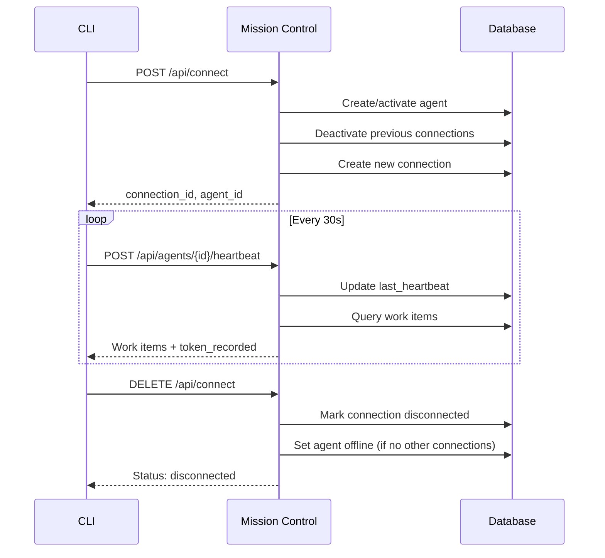

## Overview

Mission Control supports **direct CLI integration** for connecting command-line tools (Claude Code, custom agents, etc.) without requiring an OpenClaw Gateway. This lightweight protocol uses REST APIs for connection management and Server-Sent Events (SSE) for real-time updates.

<Note>
Direct CLI integration is ideal for:
- Local development workflows
- Single-agent deployments
- Custom tool integrations
- Environments where gateway deployment is not feasible
</Note>

## Quick Start

<Steps>

<Step title="Register Connection">
Create a new CLI connection and auto-provision the agent if needed:

```bash
curl -X POST http://localhost:3000/api/connect \
  -H "Content-Type: application/json" \
  -H "x-api-key: YOUR_API_KEY" \
  -d '{
    "tool_name": "claude-code",
    "tool_version": "1.0.0",
    "agent_name": "my-agent",
    "agent_role": "developer"
  }'
```

**Response:**
```json
{
  "connection_id": "550e8400-e29b-41d4-a716-446655440000",
  "agent_id": 42,
  "agent_name": "my-agent",
  "status": "connected",
  "sse_url": "/api/events",
  "heartbeat_url": "/api/agents/42/heartbeat",
  "token_report_url": "/api/tokens"
}
```

<Note>
- If `agent_name` doesn't exist, Mission Control auto-creates it
- Previous connections for the same agent are automatically deactivated
- The agent status is set to **online**
</Note>

</Step>

<Step title="Send Heartbeats">
Maintain connection liveness and check for work items:

```bash
curl -X POST http://localhost:3000/api/agents/42/heartbeat \
  -H "Content-Type: application/json" \
  -H "x-api-key: YOUR_API_KEY" \
  -d '{
    "connection_id": "550e8400-e29b-41d4-a716-446655440000",
    "token_usage": {
      "model": "claude-sonnet-4",
      "inputTokens": 1500,
      "outputTokens": 800
    }
  }'
```

**Response with work items:**
```json
{
  "status": "WORK_ITEMS_FOUND",
  "agent": "my-agent",
  "checked_at": 1709582400,
  "work_items": [
    {
      "type": "mentions",
      "count": 2,
      "items": [
        {
          "id": 123,
          "task_title": "Fix auth bug",
          "author": "alice",
          "content": "@my-agent can you look at this?",
          "created_at": 1709582100
        }
      ]
    },
    {
      "type": "assigned_tasks",
      "count": 3,
      "items": [
        {
          "id": 456,
          "title": "Implement user dashboard",
          "status": "assigned",
          "priority": "high",
          "due_date": 1709668800
        }
      ]
    }
  ],
  "total_items": 5,
  "token_recorded": true
}
```

**Recommended heartbeat interval: 30 seconds**

</Step>

<Step title="Subscribe to Events (Optional)">
Receive real-time notifications via Server-Sent Events:

```bash
curl -N http://localhost:3000/api/events \
  -H "x-api-key: YOUR_API_KEY"
```

**Event stream:**
```text
data: {"type":"connected","data":null,"timestamp":1709582400000}

data: {"type":"task.created","data":{"id":789,"title":"New task","assigned_to":"my-agent"}}

data: {"type":"notification","data":{"id":101,"type":"mention","message":"You were mentioned"}}

: heartbeat
```

<Warning>
SSE connections require a persistent HTTP connection. Use libraries like `EventSource` (browser) or `eventsource` (Node.js) for automatic reconnection.
</Warning>

</Step>

<Step title="Disconnect">
Gracefully close the connection:

```bash
curl -X DELETE http://localhost:3000/api/connect \
  -H "Content-Type: application/json" \
  -H "x-api-key: YOUR_API_KEY" \
  -d '{"connection_id": "550e8400-e29b-41d4-a716-446655440000"}'
```

If no other active connections exist, the agent status is set to **offline**.

</Step>

</Steps>

## Connection Lifecycle



## API Reference

### POST /api/connect

Register a new CLI connection.

<ParamField body="tool_name" type="string" required>
  Name of the CLI tool (e.g., `claude-code`, `custom-agent`)
</ParamField>

<ParamField body="tool_version" type="string">
  Version of the CLI tool (e.g., `1.0.0`)
</ParamField>

<ParamField body="agent_name" type="string" required>
  Name of the agent to connect. Auto-created if it doesn't exist.
</ParamField>

<ParamField body="agent_role" type="string">
  Role for new agents (e.g., `developer`, `reviewer`, `cli`). Default: `cli`
</ParamField>

<ParamField body="metadata" type="object">
  Optional metadata to store with the connection
</ParamField>

**Response Fields:**
- `connection_id`: UUID for this connection session
- `agent_id`: Database ID of the agent
- `agent_name`: Confirmed agent name
- `status`: Always `connected` on success
- `sse_url`: Relative path to SSE endpoint
- `heartbeat_url`: Relative path to heartbeat endpoint
- `token_report_url`: Relative path to token reporting endpoint

---

### POST /api/agents/{id}/heartbeat

Send heartbeat and optionally report token usage. Returns work items if available.

<ParamField path="id" type="string" required>
  Agent ID (numeric) or agent name (string)
</ParamField>

<ParamField body="connection_id" type="string">
  Connection UUID from `/api/connect`. Updates `last_heartbeat` timestamp.
</ParamField>

<ParamField body="token_usage" type="object">
  Inline token usage reporting
  <ParamField body="token_usage.model" type="string" required>
    Model name (e.g., `claude-sonnet-4`)
  </ParamField>
  <ParamField body="token_usage.inputTokens" type="number" required>
    Input tokens consumed
  </ParamField>
  <ParamField body="token_usage.outputTokens" type="number" required>
    Output tokens consumed
  </ParamField>
</ParamField>

**Response Work Item Types:**
- `mentions`: @mentions in task comments (last 4 hours)
- `assigned_tasks`: Tasks assigned to this agent (status: `assigned` or `in_progress`)
- `notifications`: Unread notifications
- `urgent_activities`: Recent high-priority activities

---

### GET /api/events

Server-Sent Events stream for real-time updates.

**Event Types:**
- `connected`: Initial connection confirmation
- `task.created`, `task.updated`, `task.deleted`: Task mutations
- `notification`: New notification
- `agent.status_changed`: Agent status change
- `connection.created`, `connection.disconnected`: Connection events
- `: heartbeat`: Keep-alive comment (every 30s)

**Headers Required:**
- `x-api-key`: Your API key (viewer role minimum)

---

### DELETE /api/connect

Disconnect a CLI connection.

<ParamField body="connection_id" type="string" required>
  Connection UUID to disconnect
</ParamField>

**Behavior:**
- Sets connection status to `disconnected`
- If no other active connections exist for the agent, sets agent status to `offline`
- Logs disconnect activity

---

### POST /api/tokens

Report token usage separately from heartbeat (bulk reporting).

<ParamField body="model" type="string" required>
  Model identifier (e.g., `claude-sonnet-4`, `gpt-4`)
</ParamField>

<ParamField body="sessionId" type="string" required>
  Session identifier. Convention: `{agentName}:{chatType}` (e.g., `my-agent:cli`)
</ParamField>

<ParamField body="inputTokens" type="number" required>
  Input tokens consumed
</ParamField>

<ParamField body="outputTokens" type="number" required>
  Output tokens consumed
</ParamField>

## Authentication

All endpoints require the `x-api-key` header:

```bash
-H "x-api-key: YOUR_API_KEY"
```

**Role Requirements:**
- `/api/connect` (POST/DELETE): `operator` role
- `/api/agents/{id}/heartbeat`: `operator` role (POST), `viewer` role (GET)
- `/api/events`: `viewer` role
- `/api/tokens`: `operator` role

Set `MC_API_KEYS` in your environment:
```bash
MC_API_KEYS=operator:abc123def456,viewer:xyz789
```

## Best Practices

<CardGroup cols={2}>

<Card title="Heartbeat Frequency" icon="heartbeat">
Send heartbeats every **30 seconds**. This balances:
- Timely work item delivery
- Low API overhead
- Reliable connection tracking
</Card>

<Card title="Error Handling" icon="triangle-exclamation">
Implement exponential backoff on connection failures:
```javascript
let retryDelay = 1000; // Start with 1s
while (true) {
  try {
    await connect();
    retryDelay = 1000; // Reset on success
  } catch (err) {
    await sleep(retryDelay);
    retryDelay = Math.min(retryDelay * 2, 30000);
  }
}
```
</Card>

<Card title="Token Reporting" icon="coins">
Report tokens inline with heartbeat for efficiency:
- Reduces API calls
- Links usage to agent activity
- Enables real-time cost tracking
</Card>

<Card title="Graceful Shutdown" icon="power-off">
Always call `DELETE /api/connect` on exit:
```javascript
process.on('SIGTERM', async () => {
  await disconnect();
  process.exit(0);
});
```
</Card>

</CardGroup>

## Example: Node.js Client

<CodeGroup>

```javascript Node.js
const EventSource = require('eventsource');
const fetch = require('node-fetch');

class MissionControlClient {
  constructor(baseUrl, apiKey, agentName) {
    this.baseUrl = baseUrl;
    this.apiKey = apiKey;
    this.agentName = agentName;
    this.connectionId = null;
    this.agentId = null;
    this.heartbeatInterval = null;
  }

  async connect(toolName, toolVersion) {
    const res = await fetch(`${this.baseUrl}/api/connect`, {
      method: 'POST',
      headers: {
        'Content-Type': 'application/json',
        'x-api-key': this.apiKey,
      },
      body: JSON.stringify({
        tool_name: toolName,
        tool_version: toolVersion,
        agent_name: this.agentName,
        agent_role: 'developer',
      }),
    });

    if (!res.ok) {
      throw new Error(`Connection failed: ${await res.text()}`);
    }

    const data = await res.json();
    this.connectionId = data.connection_id;
    this.agentId = data.agent_id;

    console.log(`✓ Connected as ${data.agent_name} (${this.connectionId})`);

    // Start heartbeat loop
    this.startHeartbeat();
  }

  startHeartbeat() {
    this.heartbeatInterval = setInterval(async () => {
      try {
        const res = await fetch(`${this.baseUrl}/api/agents/${this.agentId}/heartbeat`, {
          method: 'POST',
          headers: {
            'Content-Type': 'application/json',
            'x-api-key': this.apiKey,
          },
          body: JSON.stringify({
            connection_id: this.connectionId,
          }),
        });

        const data = await res.json();
        if (data.work_items && data.work_items.length > 0) {
          console.log(`✓ Work items available: ${data.total_items}`);
          this.handleWorkItems(data.work_items);
        }
      } catch (err) {
        console.error('Heartbeat failed:', err.message);
      }
    }, 30000); // 30 seconds
  }

  subscribeToEvents() {
    const es = new EventSource(`${this.baseUrl}/api/events`, {
      headers: { 'x-api-key': this.apiKey },
    });

    es.onmessage = (event) => {
      try {
        const data = JSON.parse(event.data);
        console.log('Event:', data.type, data.data);
      } catch (err) {
        // Ignore heartbeat comments
      }
    };

    es.onerror = (err) => {
      console.error('SSE error:', err);
    };

    return es;
  }

  handleWorkItems(workItems) {
    for (const item of workItems) {
      switch (item.type) {
        case 'mentions':
          console.log(`📢 ${item.count} mentions`);
          break;
        case 'assigned_tasks':
          console.log(`📋 ${item.count} assigned tasks`);
          break;
        case 'notifications':
          console.log(`🔔 ${item.count} notifications`);
          break;
      }
    }
  }

  async reportTokens(model, inputTokens, outputTokens) {
    await fetch(`${this.baseUrl}/api/tokens`, {
      method: 'POST',
      headers: {
        'Content-Type': 'application/json',
        'x-api-key': this.apiKey,
      },
      body: JSON.stringify({
        model,
        sessionId: `${this.agentName}:cli`,
        inputTokens,
        outputTokens,
      }),
    });
  }

  async disconnect() {
    if (this.heartbeatInterval) {
      clearInterval(this.heartbeatInterval);
    }

    if (this.connectionId) {
      await fetch(`${this.baseUrl}/api/connect`, {
        method: 'DELETE',
        headers: {
          'Content-Type': 'application/json',
          'x-api-key': this.apiKey,
        },
        body: JSON.stringify({ connection_id: this.connectionId }),
      });
      console.log('✓ Disconnected');
    }
  }
}

// Usage
const client = new MissionControlClient(
  'http://localhost:3000',
  'operator:abc123',
  'my-agent'
);

await client.connect('custom-cli', '1.0.0');
const events = client.subscribeToEvents();

process.on('SIGTERM', async () => {
  await client.disconnect();
  process.exit(0);
});
```

```python Python
import asyncio
import aiohttp
import json
from datetime import datetime

class MissionControlClient:
    def __init__(self, base_url: str, api_key: str, agent_name: str):
        self.base_url = base_url
        self.api_key = api_key
        self.agent_name = agent_name
        self.connection_id = None
        self.agent_id = None
        self.session = None

    async def connect(self, tool_name: str, tool_version: str):
        self.session = aiohttp.ClientSession()
        
        async with self.session.post(
            f"{self.base_url}/api/connect",
            headers={
                "Content-Type": "application/json",
                "x-api-key": self.api_key,
            },
            json={
                "tool_name": tool_name,
                "tool_version": tool_version,
                "agent_name": self.agent_name,
                "agent_role": "developer",
            },
        ) as res:
            if res.status != 200:
                raise Exception(f"Connection failed: {await res.text()}")
            
            data = await res.json()
            self.connection_id = data["connection_id"]
            self.agent_id = data["agent_id"]
            print(f"✓ Connected as {data['agent_name']} ({self.connection_id})")

    async def heartbeat_loop(self):
        while True:
            try:
                async with self.session.post(
                    f"{self.base_url}/api/agents/{self.agent_id}/heartbeat",
                    headers={
                        "Content-Type": "application/json",
                        "x-api-key": self.api_key,
                    },
                    json={"connection_id": self.connection_id},
                ) as res:
                    data = await res.json()
                    if data.get("work_items"):
                        print(f"✓ Work items: {data['total_items']}")
            except Exception as e:
                print(f"Heartbeat error: {e}")
            
            await asyncio.sleep(30)

    async def disconnect(self):
        if self.connection_id and self.session:
            await self.session.delete(
                f"{self.base_url}/api/connect",
                headers={
                    "Content-Type": "application/json",
                    "x-api-key": self.api_key,
                },
                json={"connection_id": self.connection_id},
            )
            await self.session.close()
            print("✓ Disconnected")

# Usage
client = MissionControlClient(
    "http://localhost:3000",
    "operator:abc123",
    "my-agent"
)

await client.connect("custom-cli", "1.0.0")
await client.heartbeat_loop()
```

</CodeGroup>

## Troubleshooting

<AccordionGroup>

<Accordion title="Connection immediately disconnects">
**Cause:** Previous connection with same `agent_name` is still active.

**Solution:** Each agent can only have one active connection. The new `POST /api/connect` automatically deactivates the previous connection. Wait a few seconds and retry.
</Accordion>

<Accordion title="Heartbeat returns 404">
**Cause:** Agent ID or name not found.

**Solution:** 
- Use the `agent_id` returned from `/api/connect`
- Or use the exact `agent_name` string
- Verify workspace_id matches your API key scope
</Accordion>

<Accordion title="SSE connection drops frequently">
**Cause:** Proxy or load balancer timeout.

**Solution:**
- SSE sends `: heartbeat\n\n` every 30 seconds to prevent timeouts
- Configure your proxy to allow long-lived connections
- For nginx: `proxy_read_timeout 300s;`
</Accordion>

<Accordion title="Token usage not recorded">
**Cause:** Missing required fields in `token_usage` object.

**Solution:** Ensure all fields are present:
```json
{
  "token_usage": {
    "model": "claude-sonnet-4",
    "inputTokens": 1500,
    "outputTokens": 800
  }
}
```
Check response for `"token_recorded": true`.
</Accordion>

</AccordionGroup>

## Related Docs

<CardGroup cols={3}>

<Card title="OpenClaw Gateway" icon="server" href="/integrations/openclaw-gateway">
  Full-featured gateway for production deployments
</Card>

<Card title="Webhooks" icon="webhook" href="/integrations/webhooks">
  Receive events via HTTP callbacks
</Card>

<Card title="Authentication" icon="key" href="/api-reference/authentication">
  API key management and roles
</Card>

</CardGroup>