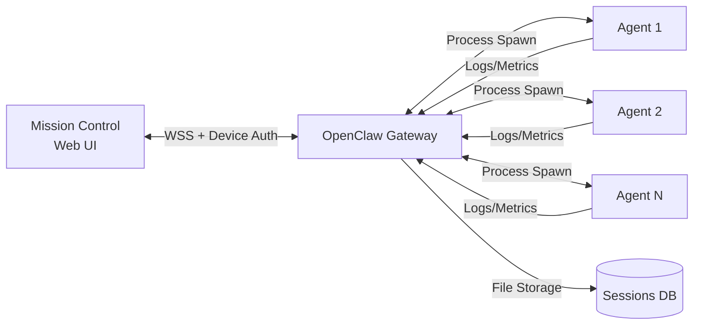

## Overview

**OpenClaw Gateway** is a production-ready gateway server designed for orchestrating multiple AI agents at scale. Mission Control connects to OpenClaw Gateway via WebSocket for real-time session management, log streaming, and agent coordination.

<Note>
For simpler deployments, see [CLI Integration](/integrations/cli-integration) for direct REST/SSE connections without a gateway.
</Note>

## Architecture



**Key Features:**
- **WebSocket Protocol v3:** Binary-efficient, fully-typed messaging
- **Device Identity Auth:** Ed25519 signature-based authentication
- **Session Management:** Multi-session tracking with token accounting
- **Real-time Logs:** Structured log streaming from agents to UI
- **Agent Spawning:** On-demand process lifecycle management
- **Heartbeat Protocol:** 30s ping/pong with RTT tracking

## Connection Protocol

### 1. WebSocket Handshake

Mission Control initiates a WebSocket connection with **protocol negotiation**:

<Steps>

<Step title="Connect to Gateway">
```javascript
const ws = new WebSocket('wss://gateway.example.com:8080');
```

No query parameters needed — authentication happens post-connect.
</Step>

<Step title="Receive Challenge">
Gateway sends a `connect.challenge` event with a nonce:

```json
{
  "type": "event",
  "event": "connect.challenge",
  "payload": {
    "nonce": "a1b2c3d4e5f6...",
    "protocols": [3],
    "deviceAuthRequired": true
  }
}
```
</Step>

<Step title="Send Connect Request with Device Auth">
Mission Control signs the nonce with Ed25519 device identity:

```json
{
  "type": "req",
  "method": "connect",
  "id": "mc-1",
  "params": {
    "minProtocol": 3,
    "maxProtocol": 3,
    "client": {
      "id": "gateway-client",
      "displayName": "Mission Control",
      "version": "2026.03.04",
      "platform": "web",
      "mode": "ui",
      "instanceId": "mc-1709582400"
    },
    "role": "operator",
    "scopes": ["operator.admin"],
    "device": {
      "id": "device-550e8400-e29b-41d4",
      "publicKey": "base64_ed25519_public_key",
      "signature": "base64_ed25519_signature",
      "signedAt": 1709582400000,
      "nonce": "a1b2c3d4e5f6..."
    },
    "deviceToken": "cached_token_if_available"
  }
}
```

**Signature Payload (v2 format):**
```
v2|device-id|client-id|client-mode|role|scopes|signed-at|device-token|nonce
```

Signed using **Ed25519** private key stored in browser `IndexedDB`.
</Step>

<Step title="Receive Connection Confirmation">
Gateway validates signature and responds:

```json
{
  "type": "res",
  "id": "mc-1",
  "ok": true,
  "result": {
    "protocol": 3,
    "sessionId": "gateway-session-123",
    "deviceToken": "new_token_for_future_reconnects",
    "features": ["spawn", "cron", "logs"]
  }
}
```

Connection is now authenticated. Mission Control caches `deviceToken` for faster reconnects.
</Step>

</Steps>

### 2. Heartbeat Protocol

Mission Control sends **ping** requests every 30 seconds:

```json
{
  "type": "req",
  "method": "ping",
  "id": "ping-1"
}
```

Gateway responds:
```json
{
  "type": "res",
  "id": "ping-1",
  "ok": true
}
```

**Timeout Behavior:**
- If **3 consecutive pongs** are missed → force reconnect
- RTT (round-trip time) is calculated: `Date.now() - sentTimestamp`
- Displayed in Mission Control UI as connection latency

### 3. Event Stream

Gateway broadcasts real-time events:

#### Session Update
```json
{
  "type": "event",
  "event": "tick",
  "payload": {
    "snapshot": {
      "sessions": [
        {
          "key": "agent1:chat",
          "kind": "chat",
          "model": "claude-sonnet-4",
          "totalTokens": 5432,
          "contextTokens": 35000,
          "messageCount": 12,
          "cost": 0.42,
          "updatedAt": 1709582400000,
          "active": true
        }
      ]
    }
  }
}
```

#### Log Entry
```json
{
  "type": "event",
  "event": "log",
  "payload": {
    "id": "log-123",
    "timestamp": 1709582400000,
    "level": "info",
    "source": "agent1",
    "session": "agent1:chat",
    "message": "Task completed successfully",
    "extra": {
      "task_id": 456
    }
  }
}
```

#### Agent Status
```json
{
  "type": "event",
  "event": "agent.status",
  "payload": {
    "id": 42,
    "name": "agent1",
    "status": "busy",
    "last_seen": 1709582400,
    "last_activity": "Processing task #456"
  }
}
```

## Device Identity Authentication

### What is Device Identity?

OpenClaw Gateway supports **device-based authentication** using **Ed25519** cryptographic signatures. Each browser generates a unique device identity stored locally, preventing credential sharing and enabling per-device authorization.

<CardGroup cols={2}>

<Card title="Security Benefits" icon="shield-check">
- **No password transmission** over network
- **Device-bound sessions** cannot be hijacked
- **Revocable per-device** access
- **Cryptographic proof** of identity
</Card>

<Card title="User Experience" icon="user">
- **Automatic authentication** after first setup
- **No password re-entry** on reconnect
- **Multi-device support** (each device has unique identity)
- **Transparent to user** (happens in background)
</Card>

</CardGroup>

### Key Generation

On first connection, Mission Control generates an Ed25519 keypair:

```javascript
import { getOrCreateDeviceIdentity } from '@/lib/device-identity';

const identity = await getOrCreateDeviceIdentity();
// {
//   deviceId: 'device-550e8400-e29b-41d4',
//   publicKeyBase64: 'base64_public_key',
//   privateKey: CryptoKey (non-exportable),
// }
```

**Storage:**
- **Private key:** `IndexedDB` (non-extractable, browser-bound)
- **Public key:** Sent to gateway during connect
- **Device ID:** UUID stored in `localStorage`

<Warning>
Device identity requires **HTTPS** or **localhost** (WebCrypto API restriction). Self-signed certificates are supported.
</Warning>

### Signature Process

1. Gateway sends **nonce** in `connect.challenge`
2. Mission Control builds signature payload:
   ```
   v2|device-id|client-id|mode|role|scopes|timestamp|token|nonce
   ```
3. Sign payload using Ed25519 private key
4. Send `signature` + `publicKey` + `nonce` in connect request
5. Gateway verifies signature using public key
6. Returns `deviceToken` for faster future reconnects

### Device Token Caching

After successful authentication, gateway issues a **device token**:
- Short-lived token (e.g., 24 hours)
- Can be used instead of full signature on reconnect
- Stored in `localStorage` as `mc_device_token`
- Automatically included in connect params

**Reconnect flow:**
```javascript
// First connect: full device signature
connect({ device: { signature, publicKey, ... } })

// Reconnect within 24h: use cached token
connect({ deviceToken: 'cached_token' })
```

## Gateway Configuration

### Control UI Settings

Gateway must explicitly allow Mission Control origin:

```yaml
# openclaw-gateway.yml
gateway:
  controlUi:
    enabled: true
    allowedOrigins:
      - https://mc.example.com  # Production
      - http://localhost:3000   # Development
    requireDeviceAuth: true
```

<Warning>
If your origin is not in `allowedOrigins`, you'll receive:
```
Gateway error: Origin not allowed
```
Add your Mission Control URL to the gateway config and restart.
</Warning>

### Device Auth Settings

```yaml
gateway:
  auth:
    deviceAuth:
      enabled: true
      requireSignature: true  # Reject unsigned connects
      tokenTTL: 86400         # Device token lifetime (seconds)
      maxDevicesPerUser: 10   # Limit devices per identity
```

If `requireSignature: true`, Mission Control **must** provide device signature. HTTP-only deployments (without WebCrypto) will fail.

### TLS Configuration

```yaml
gateway:
  tls:
    enabled: true
    certFile: /etc/certs/gateway.crt
    keyFile: /etc/certs/gateway.key
    port: 8080
```

Mission Control connects via `wss://` (WebSocket Secure).

## Spawn Agents

Gateway can spawn agent processes on-demand:

```javascript
// Send spawn request
ws.send(JSON.stringify({
  type: 'req',
  method: 'spawn',
  id: 'spawn-1',
  params: {
    command: 'python',
    args: ['agent.py', '--role', 'developer'],
    env: { AGENT_NAME: 'agent1' },
    cwd: '/opt/agents',
  }
}));
```

**Response:**
```json
{
  "type": "event",
  "event": "spawn_result",
  "payload": {
    "id": "spawn-1",
    "status": "running",
    "pid": 12345,
    "completedAt": null,
    "result": null,
    "error": null
  }
}
```

When process exits:
```json
{
  "type": "event",
  "event": "spawn_result",
  "payload": {
    "id": "spawn-1",
    "status": "completed",
    "pid": 12345,
    "completedAt": 1709582400000,
    "result": { "exitCode": 0 },
    "error": null
  }
}
```

## Error Handling

### Non-Retryable Errors

Mission Control **stops reconnecting** for these errors:

| Error | Cause | Solution |
|-------|-------|----------|
| `origin not allowed` | Origin not in `allowedOrigins` | Add your URL to gateway config |
| `device identity required` | Gateway requires device auth, but browser doesn't support WebCrypto | Use HTTPS or localhost |
| `device_auth_signature_invalid` | Invalid Ed25519 signature | Clear device identity in browser DevTools → Application → IndexedDB |
| `auth rate limit` | Too many auth attempts | Wait 1 minute, then reconnect |

**User Experience:**
- Error displayed in Mission Control logs panel
- Notification: "Gateway Handshake Blocked" with actionable help text
- Reconnect button disabled until error is resolved

### Retryable Errors

Auto-reconnect with **exponential backoff** for:
- Network errors (DNS, connection refused)
- WebSocket close codes (except 4001 non-retryable)
- Heartbeat timeout (3 missed pongs)

**Backoff schedule:**
```
Attempt 1: 1s
Attempt 2: 2s
Attempt 3: 4s
Attempt 4: 8s
Attempt 5: 16s
Attempt 6+: 30s (max)
```

## Deployment

### Docker Compose

```yaml
version: '3.8'
services:
  gateway:
    image: openclaw/gateway:latest
    ports:
      - "8080:8080"
    volumes:
      - ./gateway.yml:/etc/openclaw/gateway.yml
      - ./sessions:/var/lib/openclaw/sessions
    environment:
      - OPENCLAW_CONFIG=/etc/openclaw/gateway.yml
      - LOG_LEVEL=info
    restart: unless-stopped

  mission-control:
    image: missioncontrol/web:latest
    ports:
      - "3000:3000"
    environment:
      - GATEWAY_URL=wss://localhost:8080
    depends_on:
      - gateway
```

### Systemd Service

```ini
# /etc/systemd/system/openclaw-gateway.service
[Unit]
Description=OpenClaw Gateway
After=network.target

[Service]
Type=simple
User=openclaw
WorkingDirectory=/opt/openclaw
ExecStart=/opt/openclaw/bin/gateway --config /etc/openclaw/gateway.yml
Restart=always
RestartSec=10

[Install]
WantedBy=multi-user.target
```

```bash
sudo systemctl enable openclaw-gateway
sudo systemctl start openclaw-gateway
sudo systemctl status openclaw-gateway
```

### Nginx Reverse Proxy

Proxy WebSocket connections through Nginx:

```nginx
upstream gateway {
    server localhost:8080;
}

server {
    listen 443 ssl http2;
    server_name gateway.example.com;

    ssl_certificate /etc/letsencrypt/live/gateway.example.com/fullchain.pem;
    ssl_certificate_key /etc/letsencrypt/live/gateway.example.com/privkey.pem;

    location / {
        proxy_pass http://gateway;
        proxy_http_version 1.1;
        proxy_set_header Upgrade $http_upgrade;
        proxy_set_header Connection "upgrade";
        proxy_set_header Host $host;
        proxy_set_header X-Real-IP $remote_addr;
        proxy_set_header X-Forwarded-For $proxy_add_x_forwarded_for;
        proxy_set_header X-Forwarded-Proto $scheme;
        
        # WebSocket timeout (30s pings prevent timeout)
        proxy_read_timeout 300s;
        proxy_send_timeout 300s;
    }
}
```

## Monitoring

### Connection Health

Mission Control UI displays:
- **Connection Status:** Connected / Disconnected / Reconnecting
- **Latency:** Real-time RTT from ping/pong (ms)
- **Reconnect Attempts:** Counter during reconnection
- **Protocol Version:** Negotiated protocol (should be 3)

### Gateway Metrics

OpenClaw Gateway exposes Prometheus metrics:

```bash
curl http://localhost:9090/metrics
```

**Key metrics:**
- `openclaw_gateway_connections_total` - Active WebSocket connections
- `openclaw_gateway_messages_sent_total` - Messages sent to clients
- `openclaw_gateway_messages_received_total` - Messages from clients
- `openclaw_gateway_spawn_requests_total` - Agent spawn requests
- `openclaw_gateway_auth_failures_total` - Failed authentications

### Logs

Gateway structured logs:

```bash
sudo journalctl -u openclaw-gateway -f
```

**Example log entries:**
```json
{"level":"info","msg":"WebSocket connection established","client_id":"gateway-client","device_id":"device-550e8400","role":"operator"}
{"level":"info","msg":"Device signature verified","device_id":"device-550e8400","valid":true}
{"level":"warn","msg":"Heartbeat timeout","client_id":"gateway-client","missed_pongs":3}
```

## Troubleshooting

<AccordionGroup>

<Accordion title="Connection stuck on 'Waiting for connect challenge...'">
**Cause:** Gateway not sending `connect.challenge` event.

**Debug:**
1. Check gateway logs for connection attempt
2. Verify gateway is running: `systemctl status openclaw-gateway`
3. Test WebSocket manually:
   ```bash
   wscat -c ws://localhost:8080
   ```
4. Check firewall rules allow port 8080
</Accordion>

<Accordion title="Device signature invalid">
**Error:** `device_auth_signature_invalid`

**Solutions:**
1. Clear device identity:
   - Chrome DevTools → Application → IndexedDB → Delete `device-identity`
2. Reconnect (triggers new key generation)
3. Check browser console for WebCrypto errors
4. Ensure HTTPS (or localhost) for WebCrypto access
</Accordion>

<Accordion title="Origin not allowed">
**Error:** `origin not allowed`

**Solution:**
Add Mission Control origin to gateway config:
```yaml
gateway:
  controlUi:
    allowedOrigins:
      - https://your-mc-domain.com  # Add this
```

Restart gateway:
```bash
sudo systemctl restart openclaw-gateway
```
</Accordion>

<Accordion title="Frequent disconnections">
**Cause:** Network instability or proxy timeout.

**Solutions:**
- Check Mission Control logs for error patterns
- Verify 30s heartbeats are being sent
- Increase proxy timeout (nginx: `proxy_read_timeout 300s`)
- Check for firewall/NAT issues
- Monitor RTT — high latency may indicate network issues
</Accordion>

<Accordion title="Agent spawn fails">
**Error:** `spawn_result` with `status: 'failed'`

**Debug:**
1. Check gateway has permissions to execute command
2. Verify `cwd` path exists
3. Check agent script has execute permission: `chmod +x agent.py`
4. Review gateway logs for spawn errors
5. Test command manually:
   ```bash
   cd /opt/agents && python agent.py --role developer
   ```
</Accordion>

</AccordionGroup>

## Security Considerations

<CardGroup cols={2}>

<Card title="TLS Required" icon="lock">
**Always use WSS (WebSocket Secure) in production:**
```javascript
// Production
wss://gateway.example.com:8080

// Development only
ws://localhost:8080
```

Device auth requires HTTPS for WebCrypto API access.
</Card>

<Card title="Origin Whitelist" icon="list-check">
Limit `allowedOrigins` to trusted domains:
```yaml
allowedOrigins:
  - https://mc.example.com  # Production only
  # - https://mc-staging.example.com  # Add staging
```

Never use `*` (wildcard) in production.
</Card>

<Card title="Device Limits" icon="mobile">
Prevent device proliferation:
```yaml
deviceAuth:
  maxDevicesPerUser: 10  # Limit per identity
  tokenTTL: 86400        # 24h token lifetime
```

Users must re-authenticate after token expiry.
</Card>

<Card title="Audit Logs" icon="file-shield">
Enable gateway audit logging:
```yaml
audit:
  enabled: true
  logFile: /var/log/openclaw/audit.log
  events:
    - auth.success
    - auth.failure
    - device.registered
    - device.revoked
```
</Card>

</CardGroup>

## Related Docs

<CardGroup cols={3}>

<Card title="CLI Integration" icon="terminal" href="/integrations/cli-integration">
  Simpler REST/SSE alternative
</Card>

<Card title="WebSocket Client" icon="code" href="/architecture/websocket">
  Client implementation details
</Card>

<Card title="Authentication" icon="key" href="/api-reference/authentication">
  API key and role-based auth
</Card>

</CardGroup>